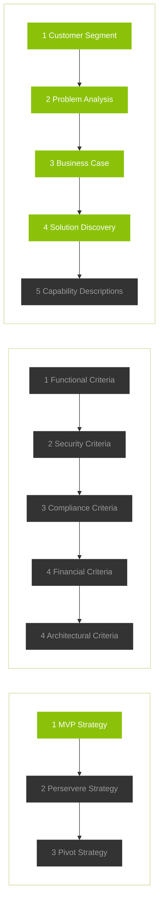
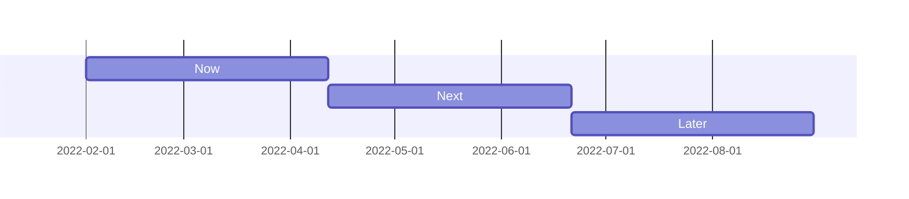

# Financial Literacy

#### Updated: `Feb 10 2022`

[TOC]

---

# Product Specifications

### Turning Ideas into Action

> 💡**`Objective:`** Product Specifications power the coordinated fulfillment of **business outcomes** in our agile environment. Product managers' **core responsibility** is to align stakeholders and pull together a set of **structured directives** that provide **clarity** **&** **context**  for Program Increments (PI) deliverables.
>
> ✅ **`Success Outcome` ** Deliver actionable definitions of feature(s) and specifically **to get features into the program backlog**.

*Updated:* `Feb 4 2022`

```
💬 Taylor [Comment]: 

My thought was that we would delete the "⚙️ Instructions" from the final versions. Those are intended to help the PMs orient themselves but not stay in the communications we send out as it adds unnessary noise.

However, I think that the "💡 Objective" and "✅ Success Outcome" sections should stay in all versions.
```


> ⚙️**`Instructions:`**At a high level, the chart below is to **visualize the progress** of the product spec work. Each stage needs to have **definitions of done** that we agree upon as a team and is understood by stakeholders. As we complete each portion of the spec work, [**update the nodes ↳**](./Mermaid JS Charts.md) in the chart to green.



```
💬 Taylor [Comment]:


```


`Fri Feb 4`

> ⚙️**`Instructions:`**Provide a running list of summary bullets in an ongoing log to document and communicate progress. Keep previous updates to provide historical context and accountability.

```
💬 Taylor [Comment]:

We shouldn't have any "Lorem ipsum" text. That's placeholder and needs to be filled out details around the specification process.

e.g., 
- "Met with compliance this week to do discovery for acceptance criteria and plan to have finalized and approved AC by end of week."
- ""
```


- Lorem ipsum dolor sit amet
- consectetur adipiscing elit
- sed do eiusmod tempor incididunt ut

`Fri Jan 28`

- Lorem ipsum dolor sit amet
- consectetur adipiscing elit
- sed do eiusmod tempor incididunt ut

## Roadmap

> ⚙️**`Instructions:`**Use the "Now", "Next", "Later" categories to communicate a high-level roadmap and help stakeholders understand where each concept, feature, or capability fits into the list. **Now** is everthing  that is being worked on in the current PI. **Next** is what we hope to get into the following PI. **Later** is everything else. PIs in this chart are set to be 10 weeks.  [**Set the date ↳**](./Mermaid JS Charts.md) of the "Now" PI, and the timeline (along with the red indicator) will automtically update.



| Now                                 | Next                              | Later                                           |
| :---------------------------------- | :-------------------------------- | :---------------------------------------------- |
| Product Specifications              | Phase I - Client Site Development | Phase II - Increase Communications              |
| Phase I -  EVERFI Site Development  |                                   | Phase IV - Enhanced Integration In Client Sites |
| Community and K-12 Site Development |                                   |                                                 |

## Release Progress & Performance

> ⚙️**`Instructions:`** Fill out critical information around the phases of releases and an estimate on level of completion. Copy and paste status bar from **[Progress Indicators.md ↳](./Progess Indicators.md)** 

| Pri. | Initiative                 | Status                                                       | PI   | Value Stream(s)          | Dept.   | PM / PO                     |
| ---- | -------------------------- | ------------------------------------------------------------ | ---- | ------------------------ | ------- | --------------------------- |
| 0    | **Product Specifications** | 🙂 **In Progress**<br /><span style="color:#8bc209">████</span>░░░░░░ 40% | -    | Product<br />App/Web Dev | Product | Nate White<br />Nick Dummit |
|      |                            |                                                              |      |                          |         |                             |
|      |                            |                                                              |      |                          |         |                             |

> ⚙️**`Instructions:`**Provide a running list of summary bullets in an ongoing log to document and communicate progress. Keep previous updates to provide historical context and accountability.

**`Fri Feb 10`**

- Developing phasing plans to begin user stories in TP. 

---

| Pri. | Initiative                            | Status                                                       | PI   | Value Stream(s) | Dept.   | Product Mgr. / <br />Product Owner |
| ---- | ------------------------------------- | ------------------------------------------------------------ | ---- | --------------- | ------- | ---------------------------------- |
| 0    | **Phase I - EVERFI Site Development** | 🙂**In Progress**<br /><span style="color:#8bc209"> ████████</span>░░ 80% | -    | Product         | Product | Nate White                         |

**`Fri Feb 4`**

- Completed designs. Provided feedback to EVERFI on initial draft sites. Worked with creative team to develop new icons. 

---

| Pri. | Initiative                              | Status                                                       | PI   | Value Stream(s) | Dept.   | Product Mgr. / <br />Product Owner |
| ---- | --------------------------------------- | ------------------------------------------------------------ | ---- | --------------- | ------- | ---------------------------------- |
| 0    | **Community and K-12 Site Development** | 🙂 **In Progress**<br /><span style="color:#8bc209">██</span>░░░░░░░░ 20% | -    | Product         | Product | Nate White                         |

**`Fri Feb 4`**

- Finalizing contract upgrade with EVERFI to unlock development with partners

  

---

# Product Details

## Product Definition

### Background & Motivation

*Updated:* `Feb 10 2022`

Financial literacy incorporates a 3rd party learning platform into the repair brands. This provides an opportunity for community engagement through rewards, emails, and learning modules as well as improve our regulatory standing. 


### Customer Segment

*Updated:* `Feb 10 2022`

Financial literacy education will be available for all service levels at Lex and CR. It will also be available on future Customer For Life products such as Freemium. 


### Problem Statement

*Updated:* `Feb 10 2022`

Our current content focuses more on consumer credit, scores, and financial assessment leaving a gap in broader financial literacy education.

Our current efforts in financial literacy lack a comprehensive set of features including engaging and personalized learning, rewards, and opportunities to give back to community partners and employees. Our current content focuses more on consumer credit, scores, and financial assessment leaving a gap in  broader financial literacy education. 

**Inspirational Why Statement** 

Support our mission to help the Hardest Working Americans navigate the path to financial well-being by providing financial literacy education, while also providing mission-focused benefits to our employees, communities, and nonprofit coalition members.


### Business Case

*Updated:* `Feb 10 2022`

**Business Value** -- Financial Literacy Education offers value in a few key areas: 

1. Self-directed learning with opportunities to send curated content based on client goals
2. Increased client interaction with the repair brands. 
3. Additional product value provided as price increases are implement
4. Low cost product, with unlimited access and fixed pricing, that can be part of Customer For Life strategies 
5. Improve regulatory standing by providing education opportunities that compliment our repair services

| Business KPIs                    | Target                                     |
| -------------------------------- | ------------------------------------------ |
| Adoption                         | 15%                                        |
| Tenure Increase Of Fin Lit users | 0.013 months (1 in 75 stay an extra month) |
| Revenue                          | $400k annual                               |
| EBITDA Impact                    | $100K annual                               |


### Solution Discovery

*Updated:* `Feb 10 2022`

> 💡`Background:`Discover solutions and get stakeholder alignment including: **Vendor selection**, **Compliance alignment**, **Value stream alignment**

| Product Capabilities                                    | Descriptions                                                 |
| ------------------------------------------------------- | ------------------------------------------------------------ |
| Financial Education at repair brands                    | Fully integrated financial education learning at the repair brands. This would include utilizing SSO and API integration for better learning and a more cohesive experience. |
| Partnerships with non-profit              organizations | With assistance from Christian Caballero, identify community partnerships that can be beneficial for PGX as well as the communities in which we work. |
| Sponsor K-12 schools                                    | Sponsorships will provide an opportunity to promote strong financial habits to students. As well as to increase good will with strategic political offices as identified with Christian Caballero. |

## Release Plan

### MVP / Pilot Strategy

> 💡`Background:` These are the **outcomes & capabilities** the product must support at launch.

- Release financial literacy at repair brands. Navbar link. Module on dashboard. Static web page on client site that will provide links to EVERFI developed financial learning playlists and courses. 

### Perservere Strategy

> 💡`Background:` These are potential **paths forward** (additional features, etc.) based on what is learned during the MVP strategy.

- Rewards campaigns based on active engagement with playlists and courses. 
- Full integration at Lexington Law and CreditRepair.com. SSO. API integration. CX campaigns. 
- Utilize financial literacy education at Credit.com. Product group to determine best uses. 
- Customer For Life. 


### Pivot Considerations

> 💡`Background:` These are the **conditions** that would make us consider alternative approaches

- N/A

  


## Acceptance Criteria

### Functional Criteria

- Lorem ipsum dolor sit amet
- consectetur adipiscing elit
- sed do eiusmod tempor incididunt ut

### Security Criteria

- Lorem ipsum dolor sit amet
- consectetur adipiscing elit
- sed do eiusmod tempor incididunt ut

### Compliance Criteria

- Lorem ipsum dolor sit amet
- consectetur adipiscing elit
- sed do eiusmod tempor incididunt ut

### Financial Criteria

- Lorem ipsum dolor sit amet
- consectetur adipiscing elit
- sed do eiusmod tempor incididunt ut

### Arcetectural Criteria

- Lorem ipsum dolor sit amet
- consectetur adipiscing elit
- sed do eiusmod tempor incididunt ut