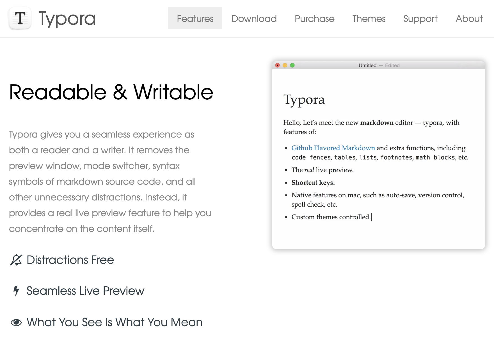
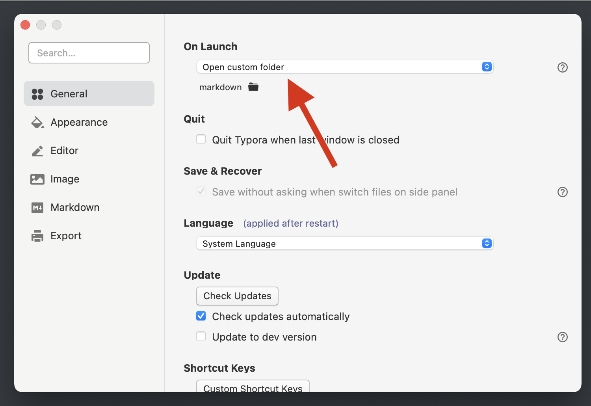

# Start Here

## What are all these documents?

This is a package of files that will help us put together Roadmap Reports that we will use in Ops Reviews, Slack Communities, Target Process, and in any other communications where product clarity and context would be appropriate. It is the first iteration, and I hope to get a lot of feedback and collaboration on improving over time.

## What is Markdown and why should we use it?

The files are written in `Markdown` and saved in the `.md` format. This is to maximize versatility.

`Markdown` is a near-universal language for technical documentation and `README` files. As such, it plays very nicely to be able to copy and paste into other platforms (Slack, Target Process). It is designed to be very efficient and very human-friendly. This will help us to spend less time working on formatting and more time working on world class products!

And Markdown is easy to export into PDFs that can be shared and sent out. You're reading a PDF exported from Markdown now!

## Okay, but how do I read and edit these files?

While there is a myriad of programs and platforms that can read and render `.md` files (pretty much every code editor or IDE works), in order for us to have consistency in our processes and formatting, everyone should be downloading and using [**Typora**](https://typora.io/). I think it's worth it to get the paid version, so expense the costs of the download.

 Now that you've downloaded and installed. Go ahead and change the `theme` to `Night` in the top menu bar:

Finally in the top menubar navigate to **`Typora` > `Preferences` > `General`** and change the **`On Launch`** option to **`Open Custom Folder`**. Set the folder to `Product Roadmap Reports` that you unzipped to get this PDF. Note: You may have to move or save that folder into a more convenient place than your downloads folder for long-term safe keeping.

You may need to close and open the program again, but when you do, you should now see the files in the left tray of your window.

Open up **`Product Roadmap Report Template.md`** and start orienting yourself to the Roadmap Structure. Keep this as a reference. When you start building your own off of the template, duplicate and rename the file.
